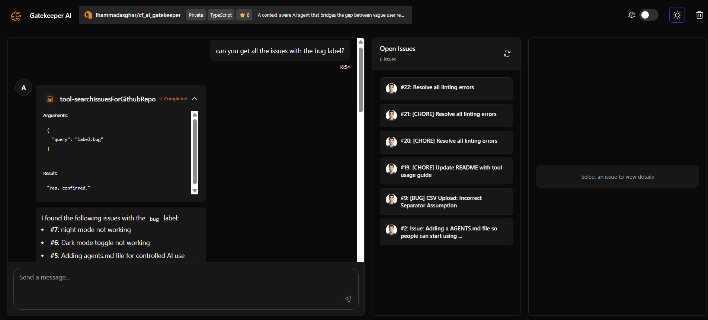
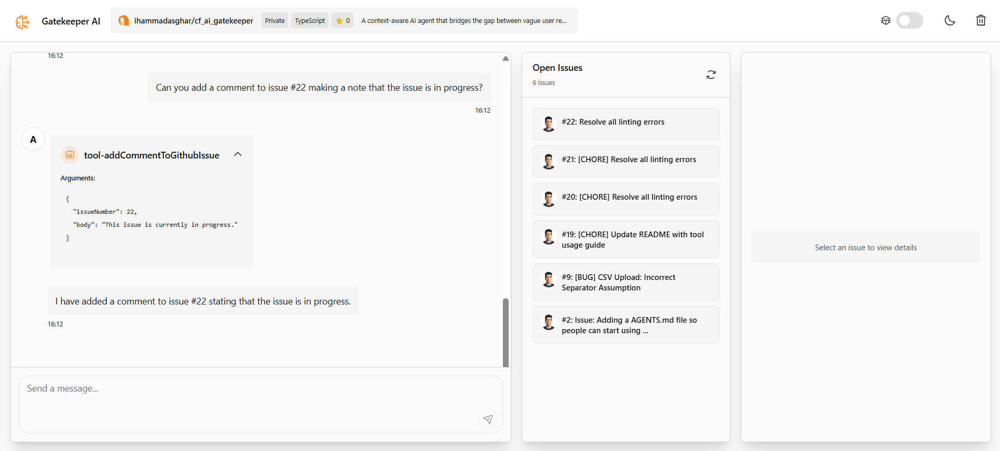

# 🛡️ Gatekeeper AI

Try it now live: [Cloudflare Pages](https://gatekeeper-ai.ihammadasghar.workers.dev/)

A context-aware AI agent that bridges the gap between vague user reports and actionable engineering tasks. By referencing your repository's internal documentation, Gatekeeper AI ensures every ticket is structured, labeled, and complete before it ever hits the backlog. It is made levraging Cloudflare Workers, Durable Objects and Agents SDK.

## Features

- **Natural Language Issue Management:** Chat with the agent to create, edit, or close issues.
- **Context-Aware Labeling:** Automatically fetches your repository's specific issue templates and labels to ensure consistency.
- **Intelligent Search:** Quickly find existing issues in your backlog using semantic search capabilities.
- **Reasoned Closures:** When closing an issue, the agent provides a clear, documented reason for future reference.
- **Bridge the Gap:** Transforms ambiguous user feedback into structured, technical tasks by cross-referencing your internal docs.

## Prerequisites

- Cloudflare account
- Google Gemini API key (Find at [aistudio.google.com](https://aistudio.google.com/api-keys))
- A github repository to manage it's backlog
- A github token with permission to 1. Read access to code and metadata and 2. Read and Write access to issues. You can make a token here [Github: Personal Access Token](https://github.com/settings/personal-access-tokens)

## Getting Started

1. Install dependencies:

```bash
npm install
```

2. Set up your environment:

Create a `.dev.vars` file:

```env
GITHUB_REPO_URL=
GITHUB_TOKEN=
GOOGLE_GENERATIVE_AI_API_KEY=
```

4. Run locally:

```bash
npm start
```

5. Deploy:

```bash
npm run deploy
```

## Screenshots

---

## See it in Action



## 

## Tech Stack

Gatekeeper is built for speed and statefulness at the edge:

- **[Cloudflare Workers](https://workers.cloudflare.com/):** For lightning-fast, global execution.
- **[Durable Objects](https://developers.cloudflare.com/workers/learning/using-durable-objects/):** To maintain stateful chat sessions and agent memory.
- **[Cloudflare Agents SDK](https://www.google.com/search?q=https://github.com/cloudflare/agents-sdk):** Powering the logic and tool-calling capabilities of the AI.

---

## Customization & Control

Developers can fine-tune the agent’s personality and technical accuracy without touching the core logic. Navigate to `src/lib/prompts.ts` to:

1. **Modify the Agent’s Role:** Change how the agent identifies itself and its "strictness" level when vetting issues.
2. **Tweak Tool Descriptions:** Adjust the natural language descriptions of the tools (create issue, search, etc.) to improve how the LLM decides to use them.

```typescript
// Example: src/lib/prompts.ts
export const SYSTEM_PROMPT =
  "You are Gatekeeper AI, a meticulous project manager...";
```

## Potential Future Improvements

- Multi-Platform Integration: Expand beyond GitHub to support Jira, Linear, and Trello for cross-platform project management.
- Documentation RAG (Retrieval-Augmented Generation): Deeply ingest local Markdown files, Wikis, and Slack history to provide the agent with even more internal context when vetting issues.
- Proactive Backlog Management: A scheduled task (via Cloudflare Triggers) that allows the agent to periodically scan the backlog for duplicate issues or stale tasks that need closing.
